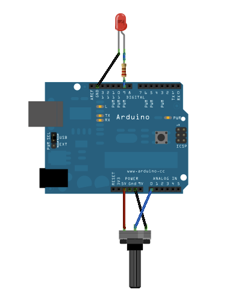
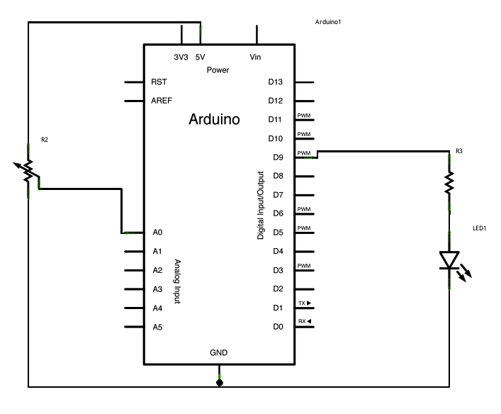

[⬅️ Back to Main Repository](../README.md)

# DAY 4


## Overview
This folder contains experiments focused on interfacing the Arduino Nano 33 BLE with a Grove RGB LCD and the onboard APDS9960 color sensor. 

## Projects Included

### Project 1: AnalogInOutSerial (LCD Hello World)
Despite the original folder name, this sketch simply initializes an I2C-based Grove RGB LCD, sets the backlight color to white, and prints a "Hello World!" message along with the author's name to the screen.

### Project 2: ColorSensor
This sketch uses the onboard APDS9960 sensor to detect the color of objects placed near it. It classifies the color (Red, Green, Blue, Yellow, Cyan, Magenta, White, Black) and displays the detected color name on the Grove RGB LCD while simultaneously changing the LCD's backlight to match the detected color.

## Folder Structure

```text
DAY4/
├── AnalogInOutSerial/
│   ├── AnalogInOutSerial.ino
│   ├── AnalogInOutSerial.txt
│   ├── layout.png
│   ├── schematic.png
│   ├── WhatsApp Image 2026-07-09 at 11.57.53 AM.jpeg
│   └── WhatsApp Image 2026-07-09 at 11.58.01 AM.jpeg
└── ColorSensor/
    ├── ColorSensor.ino
    ├── WhatsApp Image 2026-07-09 at 10.11.44 PM.jpeg
    ├── WhatsApp Image 2026-07-09 at 10.11.45 PM.jpeg
    ├── WhatsApp Image 2026-07-09 at 12.17.17 PM.jpeg
    └── WhatsApp Video 2026-07-09 at 10.11.18 PM.mp4
```

| File | Purpose |
|------|---------|
| `AnalogInOutSerial.ino` | Sketch that prints text to the Grove RGB LCD. |
| `layout.png` & `schematic.png` | Hardware layout and circuit diagrams. |
| `ColorSensor.ino` | Sketch that reads the APDS9960 color sensor and updates the LCD. |

## Hardware Required
| Component | Description |
|-----------|-------------|
| **Arduino Nano 33 BLE Sense** | Microcontroller with onboard APDS9960 sensor. |
| **Grove RGB LCD** | I2C display for textual and color feedback. |
| **Connecting Wires** | For connecting the I2C Grove port to the Arduino pins. |

## Software Required
| Software | Role |
|----------|------|
| **Arduino IDE** | Compilation and flashing. |

## Libraries Used
- `Wire.h` (I2C Communication)
- `rgb_lcd.h` (Grove RGB LCD library)
- `Arduino_APDS9960.h` (Color sensor library)

## Project Architecture

```text
Arduino Nano 33 BLE Sense
        │
   I2C (SDA, SCL)
        │
 Grove RGB LCD
```

## Working Principle
- **LCD Hello World**: The microcontroller acts as an I2C master to initialize the LCD, set the backlight color, and transmit characters to be displayed on the screen.
- **Color Sensor**: The microcontroller continuously reads RGB components from the APDS9960 sensor. It applies conditional logic based on RGB thresholds and overall brightness to classify the color. Upon a successful classification, it updates the I2C LCD text and backlight to match the object's color.

## Program Flow

```text
Start
  ↓
Initialize I2C, LCD, and APDS9960
  ↓
Read Sensor (RGB values)
  ↓
Process Data (Classify color via thresholds)
  ↓
Display Output (Print to LCD and change backlight)
  ↓
Repeat
```

## Expected Output
- **LCD Hello World**: The LCD turns white and displays the static welcome text.
- **Color Sensor**: As you place different colored objects near the board's sensor, the LCD dynamically changes its text (e.g. "Detected: RED") and its backlight color updates instantly.

<details>
<summary><b>🖼️ View Project Media</b></summary>
<br>

**Wiring & Schematic**



**LCD Setup**


**Color Sensor Demo**


*Note: See [ColorSensor Video](ColorSensor/WhatsApp%20Video%202026-07-09%20at%2010.11.18%20PM.mp4) for a live demonstration.*
</details>

## Learning Outcomes
- 📌 I2C device interfacing.
- 📌 LCD control and cursor positioning.
- 📌 Reading and processing ambient color and brightness data.
- 📌 Creating a feedback loop between a sensor and an external display.

## How to Run
1. Connect the Grove RGB LCD to the I2C pins (SDA, SCL, VCC, GND).
2. Open either `AnalogInOutSerial.ino` or `ColorSensor.ino` in the Arduino IDE.
3. Ensure the `Arduino_APDS9960` and `rgb_lcd` libraries are installed.
4. Select **Arduino Nano 33 BLE** and the corresponding COM port.
5. Click **Upload**.

## Folder Notes
Note that the `AnalogInOutSerial` folder does not contain an ADC/PWM sketch as the name might originally suggest, but instead contains an LCD initialization sketch. The folder also contains multiple media files documenting the setup and demonstration.

## Related CPS Lab
**Related Lab:** Color Sensor and LCD Interfacing Lab

---
[⬅️ Back to Main Repository](../README.md)
