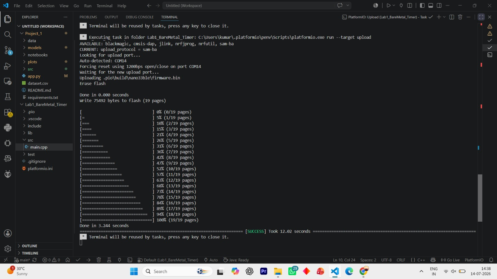

[⬅️ Back to Main Repository](../README.md)

# Day 7


## Overview
This folder contains a lower-level bare-metal programming experiment targeting the nRF52840 microcontroller inside the Arduino Nano 33 BLE. Instead of using high-level Arduino `delay()` or `millis()` functions, this project directly manipulates hardware registers to configure a hardware timer and interrupt service routine (ISR) to blink an LED.

## Projects Included

### Project 1: Lab1_BareMetal_Timer
A PlatformIO-based C++ project that bypasses the standard Arduino API. It configures the nRF52840's `TIMER3` peripheral to generate an interrupt exactly once per second (1 Hz). The Interrupt Service Routine (ISR) toggles the onboard LED directly via GPIO registers.

## Folder Structure

```text
Day 7/
└── Lab1_BareMetal_Timer/
    ├── .vscode/
    ├── src/
    │   └── main.cpp
    ├── Output.jpeg
    └── platformio.ini
```

| File | Purpose |
|------|---------|
| `src/main.cpp` | Main C++ source code containing register-level initialization and the ISR. |
| `platformio.ini` | PlatformIO configuration file defining the board and framework. |
| `Output.jpeg` | Image showing the output/setup of the experiment. |

## Hardware Required
| Component | Description |
|-----------|-------------|
| **Arduino Nano 33 BLE** | Target microcontroller. |
| **USB Cable** | Power and serial connection. |

## Software Required
| Software | Role |
|----------|------|
| **Visual Studio Code** | IDE environment. |
| **PlatformIO Extension** | Embedded development build system. |

## Libraries Used
- `<Arduino.h>` (for basic setup/loop structure and delay)
- `<nrf.h>` (Nordic Semiconductor register definitions)

## Working Principle
The code directly configures the `NRF_TIMER3` peripheral. 
1. The timer is set to 32-bit mode.
2. A prescaler of 4 is applied to the 16MHz base clock, resulting in a 1MHz timer clock (1 tick = 1 microsecond).
3. The Capture/Compare register (`CC[0]`) is loaded with `1,000,000`.
4. The timer is configured to automatically clear and trigger an interrupt when the count reaches `1,000,000` (i.e., every 1 second).
5. The `TIMER3_IRQHandler` function catches the hardware interrupt and toggles the `NRF_P0` GPIO register to turn the LED on or off.

## Program Flow

```text
Start
  ↓
Configure GPIO Pin 13 as Output via NRF_P0->PIN_CNF
  ↓
Stop and Clear NRF_TIMER3
  ↓
Set Timer Mode, Bitwidth, Prescaler, and Compare Value
  ↓
Enable Auto-Clear Shortcut & Timer Interrupts
  ↓
Register and Enable ISR in the NVIC
  ↓
Start Timer
  ↓
Main Loop (Idle) ←→ Hardware Interrupt toggles LED every 1s
```

## Expected Output
The onboard LED blinks on and off precisely every 1 second, driven entirely by a hardware timer independent of the main loop's execution.

<details>
<summary><b>🖼️ View Output</b></summary>
<br>



</details>

## Learning Outcomes
- 📌 Bare-metal register manipulation (Nordic nRF52 architecture).
- 📌 Configuring hardware timers and prescalers.
- 📌 Setting up and handling Interrupt Service Routines (ISRs) via the NVIC.
- 📌 Transitioning from Arduino IDE to PlatformIO.

## How to Run
1. Open the `Lab1_BareMetal_Timer` folder in Visual Studio Code with the PlatformIO extension installed.
2. Connect the Arduino Nano 33 BLE.
3. Click the "PlatformIO: Upload" button (right arrow icon) in the bottom status bar to compile and flash the firmware.

## Folder Notes
This project requires PlatformIO rather than the standard Arduino IDE due to its specific build environment structure (`src/`, `platformio.ini`).

## Related CPS Lab
**Related Lab:** Real-Time Operating Systems and Timers Lab

---
[⬅️ Back to Main Repository](../README.md)
