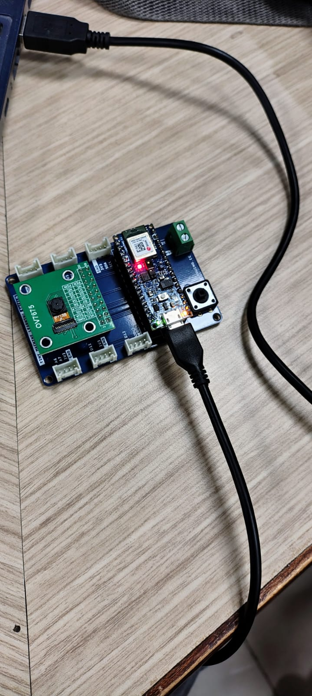

[⬅️ Back to Main Repository](../README.md)

# Day 9


## Overview
This folder contains a proximity counting experiment using the onboard APDS9960 sensor on the Arduino Nano 33 BLE Sense. 

## Projects Included

### Project 1: ProximitySensor (Counter)
A sketch that reads proximity data and maintains a counter of how many times an object has come close to the sensor. It provides visual feedback using the onboard LED (pin 13) and triggers a red LED state change when a specific count threshold (10) is reached.

## Folder Structure

```text
Day9/
└── ProximitySensor/
    ├── Output.jpeg
    └── ProximitySensor.ino
```

| File | Purpose |
|------|---------|
| `ProximitySensor.ino` | Arduino sketch for counting proximity events and controlling LEDs. |
| `Output.jpeg` | Image of the experiment output. |

## Hardware Required
| Component | Description |
|-----------|-------------|
| **Arduino Nano 33 BLE Sense** | Board featuring the APDS9960. |
| **USB Cable** | Data and power transfer. |

## Software Required
| Software | Role |
|----------|------|
| **Arduino IDE** | Compilation and serial monitoring. |

## Libraries Used
- `Arduino_APDS9960.h` (Proximity sensor library)

## Working Principle
The program continuously reads proximity values (0 to 255). It implements a state machine using a boolean flag (`isLastAbove100`) to detect when an object crosses a specific threshold (value drops below 100). 
Each valid crossing increments a `count` variable and toggles the onboard LED (pin 13). Once the `count` reaches exactly 10, it activates the onboard red LED (`LEDR`) by pulling it LOW (active-low logic). The current proximity value and count are printed to the Serial Monitor.

## Program Flow

```text
Start
  ↓
Initialize APDS9960, Serial, and LED pins
  ↓
Read Proximity Sensor
  ↓
If object moves close (< 100) and was previously far: Increment count, turn Pin 13 ON
  ↓
If count == 10: Turn Red LED ON
  ↓
If object moves far (> 100): Turn Pin 13 OFF, reset state flag
  ↓
Print Proximity and Count to Serial
  ↓
Repeat
```

## Expected Output
Moving your hand close to and away from the sensor will increment the counter displayed on the Serial Monitor. The built-in LED on pin 13 will turn on while your hand is close. After 10 distinct "close" events, the red LED on the board will illuminate.

<details>
<summary><b>🖼️ View Output Image</b></summary>
<br>



</details>

## Learning Outcomes
- 📌 Using state variables to detect edge transitions (crossing thresholds).
- 📌 Implementing event counters based on analog sensor data.
- 📌 Basic conditional logic for hardware triggers.

## How to Run
1. Open `ProximitySensor.ino` in the Arduino IDE.
2. Install the `Arduino_APDS9960` library.
3. Select "Arduino Nano 33 BLE" and the COM port.
4. Click "Upload".
5. Open the Serial Monitor at 9600 baud.
6. Move your hand close to the board 10 times to see the Red LED trigger.

## Folder Notes
This experiment relies on the active-low nature of the Nano 33 BLE's RGB LED (`LEDR` is set `LOW` to turn it on).

## Related CPS Lab
**Related Lab:** Proximity Sensor Lab

---
[⬅️ Back to Main Repository](../README.md)
